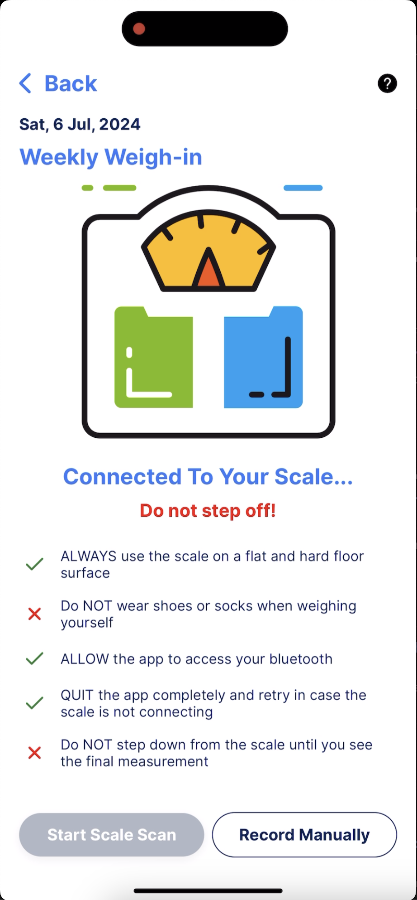

# IoT - BLE BMI Tracker Application 

An innovative IoT application designed to connect to a Bluetooth Low Energy (BLE) scale. The app seamlessly records users' Body Mass Index (BMI), providing a user-friendly interface for tracking and analyzing health metrics.

## Key Features

**BLE Integration**: Effortlessly connects to BLE scales to gather weight and height data.
**BMI Calculation**: Automatically calculates and records the BMI of the user.
**User-Friendly Interface**: Intuitive design for easy tracking and monitoring of health metrics.
**Data Storage**: Securely stores user data for future reference and analysis.

## Screenshot

